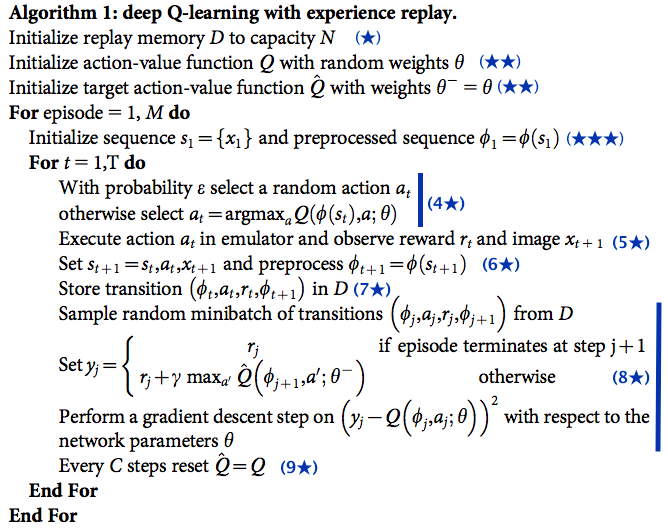

# Deep Q Learning (DQN)
Python implementation of Deepminds DQN derived from the paper Mnih et al., 2013 arXiv:1312.5602v1 Playing Atari game Breakout in gym environment running on tensorflow version 2.3.1 and keras version 2.4.0. The code is my free interpretation of the mentioned paper based on my understanding and available information also supported by some available material in GitHub I referred in the below code description. The intention of this code is just to study the DQN approach in the library I'm more familiar to use. A big thanks to all the contributors I referred below. In case I miss some one else please advice I'll integrate and sorry for that.


* **Input pre-processing**\
images from gym environment (210x160x3) are converted in gray color, then crop off upper score (31 lines) and below black area (15 lines). finaly resize  at 84x84 using resample=Image.BILINEAR as in the paper. The dtype=np.uint8 is used to use less memory when it is stored in the ReplayMemory. When those frames are provided in input ot the model those are dividied by 255 to keep the range from 0 to 1.

* **Model**\
first layer: 32conv2D with kernel 8x8 stride=4 and initialization keras.initializers.VarianceScaling(scale=2.0) , RELU , Dropout 40%\
second layer: 64conv2D with kernel 4x4 stride=2 and initialization keras.initializers.VarianceScaling(scale=2.0) , RELU , Dropout 20%\
third layer: 64conv2D with kernel 3x3 stride=1 and initialization keras.initializers.VarianceScaling(scale=2.0) , RELU , Dropout 20%\
final hidden layer is fully-connected and consists of 512 rectifier units\
The output layer is a fully-connected linear layer with a single output for each valid action. In the case of Breakout =4 


* **ReplayMemory**\
function derived from https://github.com/fg91/Deep-Q-Learning/blob/master/DQN.ipynb
Having this need to store the last number of transitions: size=1,000,000  It is created to save memory space containing only action, reward , future fame (84x84) and terminator flag.

* **Minibatch**\
Each state contain 4 consecutive immages from the environment (84x84x4), the action , the reward obtained doing the action, the new state(84x84x4) and finally the terminator flag reporting if the frame is related to the end game or not. 

* **Training**\
used Adam as optimizer with a fixed learning rate

* **Epsilon decay**\
followed the paper and after 1M of fames the decay is manteined as suggested in above mentioned link of fg91. I consider this a valuable approach so I mantenined in this implementation

* **Parameters**\
all parameter are derived from Tab 1 of the paper "Human-level control through deep reinforcement learning". Only learning rate is used based on paper released in 2015 by Mnih et all using LR=0.00025

The code is running and a progress in the reward is visible. I'm not using TensorBoard but I left the class used in above mentioned link of fg91 to keep more speed in the computation. Due to the limited computetional power in my PC I'm not able to run it till a good final score. I left some portion of the code I used for Deguging in case should be usefull to some one. Inside the ```for episode``` I concentrate the call to all the key function of the algorithm as reported in the original paper and as listed in https://towardsdatascience.com/tutorial-double-deep-q-learning-with-dueling-network-architectures-4c1b3fb7f756 . To keep it more readable I moved all the referenced star number in that plance.




Personally I do believe that there is still a very long road befor to create an algorithm with the efficiency of the human brain having that the training in the paper was executed on a total of 38 days of game experience. For this reason as far as I can see also if the performance are better then human it is still a big limitation to move forward on more complicated tasks to apply the "General AI". For this reason I will not use my time to study the evolution of this approach published by Deepmind, but I prefer to look forward on a different approach. My inspiration is to move far from the Bellman equation.
